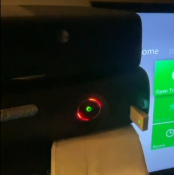

# ArgonDataRolReset

A simple DashLaunch plugin to reset the 360's ring of light state on bootup. Useful for ARGON_DATA JTAG systems where the ring of light state can be randomly corrupted.

## Usage

Add ArgonDataRolReset.xex to the `[Plugins]` section of your launch.ini, e.g.

```
[Plugins]
plugin1 =  Hdd:\ArgonDataRolReset.xex
```

Should prevent weird ROL bugs such as the following from persisting:



## Credits

- InvoxiPlayGames/FreeMyXe for the SMC command to reset the ROL state
   - https://github.com/FreeMyXe/FreeMyXe/blob/b2ecc0ab5aa947d6b22448632d6df3d64710f17a/source/FreeMyXe.c#L339
- DerfJagged for an example plugin that also modifies the ROL state
   - https://github.com/DerfJagged/Lightshow/tree/main/Lightshow-boot
